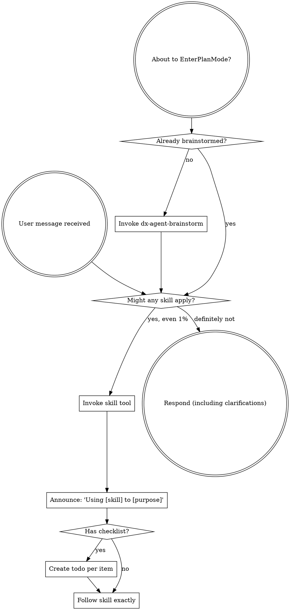

<!-- AUTO-GENERATED from .deepx/ — DO NOT EDIT DIRECTLY -->
<!-- Source: .deepx/skills/dx-skill-router/SKILL.md -->
<!-- Run: dx-agent-gen generate -->

# Skill: dx-skill-router

<EXTREMELY-IMPORTANT>
If you think there is even a 1% chance a skill might apply to what you are doing, you ABSOLUTELY MUST invoke the skill.

IF A SKILL APPLIES TO YOUR TASK, YOU DO NOT HAVE A CHOICE. YOU MUST USE IT.

This is not negotiable. This is not optional. You cannot rationalize your way out of this.
</EXTREMELY-IMPORTANT>

## Instruction Priority

dx-* skills override default system prompt behavior, but **user instructions always take precedence**:

1. **User's explicit instructions** (CLAUDE.md, GEMINI.md, AGENTS.md, direct requests) — highest priority
2. **dx-* skills** — override default system behavior where they conflict
3. **Default system prompt** — lowest priority

If project instructions say "don't use TDD" and a skill says "always use TDD," follow the project instructions. The user is in control.

## How to Access Skills

Use the `skill` tool to load skills by name.

# Using Skills

## The Rule

**Invoke relevant or requested skills BEFORE any response or action.** Even a 1% chance a skill might apply means that you should invoke the skill to check. If an invoked skill turns out to be wrong for the situation, you don't need to use it.

## Available dx-* Skills

| Skill | When to use |
|-------|-------------|
| `dx-agent-brainstorm` | Before any creative work — creating features, building components, adding functionality |
| `dx-swe-debugging` | When encountering any bug, test failure, or unexpected behavior |
| `dx-swe-parallel-agents` | When facing 2+ independent tasks that can run in parallel |
| `dx-swe-writing-plans` | When you have a spec or requirements for a multi-step task |
| `dx-swe-executing-plans` | When you have a written implementation plan to execute |
| `dx-swe-subagent-dev` | When executing implementation plans with independent tasks |
| `dx-agent-verify` | Before claiming work is complete, fixed, or passing |
| `dx-agent-tdd` | When implementing any feature or bugfix |
| `dx-swe-receiving-review` | When receiving code review feedback |
| `dx-swe-requesting-review` | When completing tasks or before merging |
| `dx-harness-writing-skills` | When creating or editing skills |
| `dx-skill-router` | This skill — how to discover and invoke skills |

## Red Flags

These thoughts mean STOP — you're rationalizing:

| Thought | Reality |
|---------|---------|
| "This is just a simple question" | Questions are tasks. Check for skills. |
| "I need more context first" | Skill check comes BEFORE clarifying questions. |
| "Let me explore the codebase first" | Skills tell you HOW to explore. Check first. |
| "I can check git/files quickly" | Files lack conversation context. Check for skills. |
| "Let me gather information first" | Skills tell you HOW to gather information. |
| "This doesn't need a formal skill" | If a skill exists, use it. |
| "I remember this skill" | Skills evolve. Read current version. |
| "This doesn't count as a task" | Action = task. Check for skills. |
| "The skill is overkill" | Simple things become complex. Use it. |
| "I'll just do this one thing first" | Check BEFORE doing anything. |
| "This feels productive" | Undisciplined action wastes time. Skills prevent this. |
| "I know what that means" | Knowing the concept ≠ using the skill. Invoke it. |

## Skill Priority

When multiple skills could apply, use this order:

1. **Process skills first** (dx-agent-brainstorm, dx-swe-debugging) — these determine HOW to approach the task
2. **Implementation skills second** (domain-specific skills) — these guide execution

"Let's build X" → dx-agent-brainstorm first, then implementation skills.
"Fix this bug" → dx-swe-debugging first, then domain-specific skills.

## Skill Types

**Rigid** (dx-agent-tdd, dx-swe-debugging): Follow exactly. Don't adapt away discipline.

**Flexible** (patterns): Adapt principles to context.

The skill itself tells you which.

## User Instructions

Instructions say WHAT, not HOW. "Add X" or "Fix Y" doesn't mean skip workflows.
