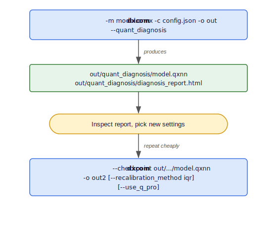
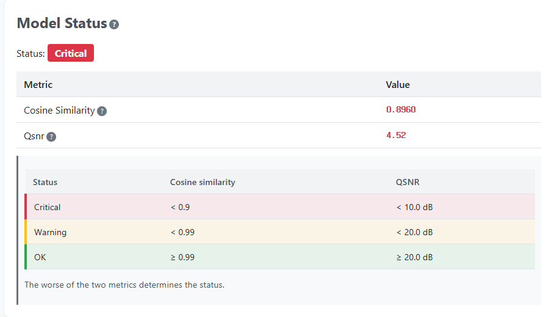
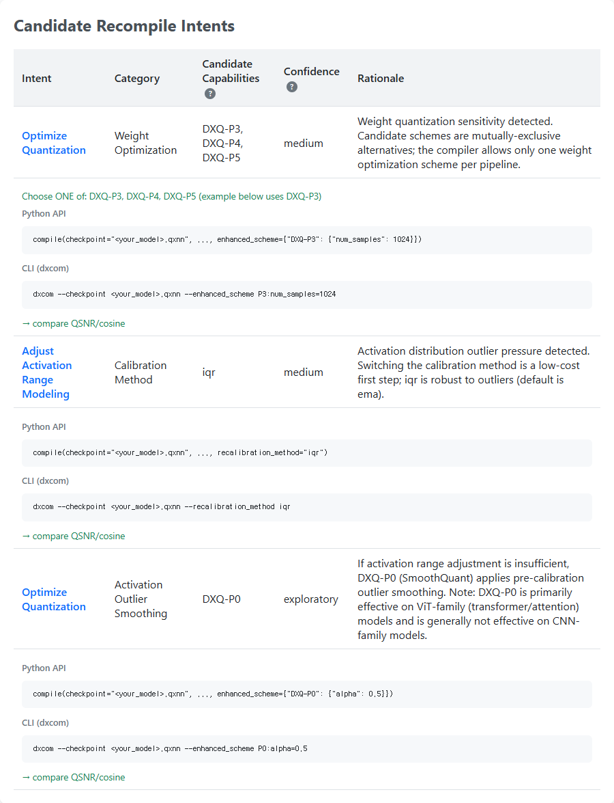
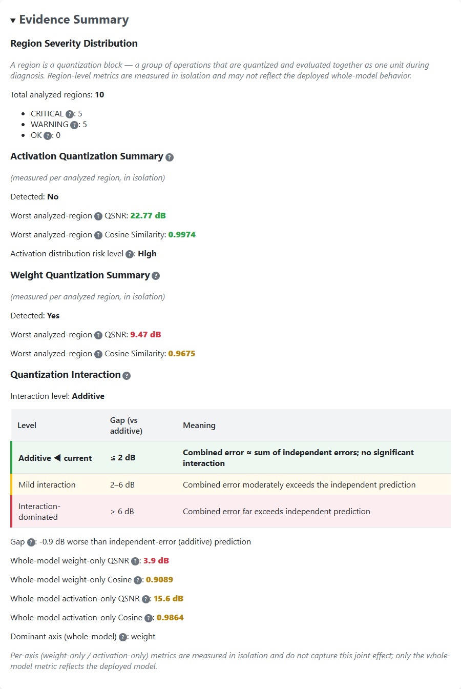

# Quantization Tuning Workflow

When a model's quantized accuracy is lower than expected, DX-COM provides a tuning loop that lets you **diagnose** which regions are degrading accuracy and **re-quantize** with new settings **without repeating the full compilation**. This chapter covers the two features that make up that loop:

- **Quantization Diagnosis (`quant_diagnosis`)** — generates an HTML report of per-layer quantization quality and a reusable `.qxnn` checkpoint.
- **QXNN Resume** — re-runs quantization from a `.qxnn` checkpoint, skipping the earlier compile phases.

!!! note "Version Support"
    `quant_diagnosis` and QXNN Resume are available in **DX-COM v2.4.0 and later**. Both are accessible from the `dxcom` CLI and the `dx_com` Python API.

---

## The Diagnose → Resume Loop

Standard quantization tuning requires recompiling the model from ONNX every time you change a setting, which is slow. The diagnose → resume loop removes that cost:

{ width=480px }

Because the resume path reuses everything that does not depend on quantization, you can iterate over several calibration methods or Q-PRO settings quickly.

---

## Quantization Diagnosis (`quant_diagnosis`)

Enabling `quant_diagnosis` during compilation produces an HTML report that visualizes per-layer quantization quality, flags high-severity regions, and includes ready-to-paste compile snippets for retrying with recommended settings. It also emits a `.qxnn` resume artifact so you can act on those recommendations without recompiling.

The option is self-contained — it does not require any other debug flag.

!!! note "What is a *region*?"
    A **region** is a quantization block — a group of operations that are quantized and evaluated together as one unit during diagnosis. The report grades each region into a severity tier (**OK / Warning / Critical**) and reports region-level metrics (Cosine Similarity, QSNR) measured in isolation, which may not fully reflect deployed whole-model behavior.

The report contains three parts:

- **Model Status** — overall judgment (OK / Warning / Critical) with whole-model Cosine Similarity and QSNR.
- **Candidate Recompile Intents** — suggested next steps (e.g., a DXQ-P\* scheme or a different calibration method), each with ready-to-paste Python API and `dxcom` CLI snippets.
- **Evidence Summary** — region severity distribution and weight/activation quantization details.

### Reading the Report

**Model Status** gives the at-a-glance verdict. The status badge (here, *Critical*) is derived from the worse of the whole-model Cosine Similarity and QSNR, graded against the thresholds shown below it.

{ width=600px }

**Candidate Recompile Intents** lists the recommended next steps in priority order. Each intent comes with ready-to-paste **Python API** and **`dxcom` CLI** snippets that target the `.qxnn` checkpoint, so you can apply the suggestion directly via [QXNN Resume](#qxnn-resume-re-quantization-without-recompile). The candidate capabilities (e.g., `DXQ-P3`/`P4`/`P5`) are mutually-exclusive alternatives — pick one.

{ width=600px }

**Evidence Summary** (collapsible) backs the recommendations with the per-layer severity distribution and weight/activation quantization details that the diagnosis is based on.

{ width=600px }

### Usage

**`dxcom` Command**
```bash
dxcom \
  -m large_model.onnx \
  -c config.json \
  -o output/large_model \
  --quant_diagnosis
```

**`dx_com` Python Module**
```python
import dx_com

dx_com.compile(
    model="large_model.onnx",
    output_dir="output/large_model",
    config="config.json",
    quant_diagnosis=True,
)
```

### Output Files

`quant_diagnosis` creates a `quant_diagnosis/` subdirectory under `output_dir`:

| File | Description |
| :--- | :--- |
| `quant_diagnosis/{model}.qxnn` | Resume checkpoint consumed by QXNN Resume |
| `quant_diagnosis/diagnosis_report.html` | Per-layer quantization quality report with retry snippets |

!!! note
    The `.qxnn` checkpoint is always written when diagnosis runs; the HTML report is written on diagnosis success.

---

## QXNN Resume (Re-quantization Without Recompile)

QXNN Resume takes a `.qxnn` checkpoint and re-runs only the quantization-dependent stages (`Quantization → Optimize → Codegen → SingleArtifact`). The original ONNX model and config are **not** needed — the calibration settings are embedded in the checkpoint.

A `.qxnn` checkpoint is produced by `quant_diagnosis` (see above).

### Selecting Resume Mode

QXNN resume mode is selected by passing a `.qxnn` checkpoint:

- **CLI**: `--checkpoint <path>.qxnn`
- **Python**: `checkpoint="<path>.qxnn"`

The checkpoint file extension must be `.qxnn` (case-insensitive); any other extension raises `ValueError`.

### Usage

**Re-calibrate with a different observer:**
```bash
dxcom \
  --checkpoint output/large_model/quant_diagnosis/large_model.qxnn \
  -o output/large_model_iqr \
  --recalibration_method iqr
```

**Enable automatic Q-PRO on resume:**
```bash
dxcom \
  --checkpoint output/large_model/quant_diagnosis/large_model.qxnn \
  -o output/large_model_qpro \
  --use_q_pro
```

**`dx_com` Python Module:**
```python
import dx_com

dx_com.compile(
    checkpoint="output/large_model/quant_diagnosis/large_model.qxnn",
    output_dir="output/large_model_iqr",
    recalibration_method="iqr",   # or: use_q_pro=True
)
```

### Resume-Only Options

The following arguments apply **only** in QXNN resume mode (i.e., together with `--checkpoint`). Using them in standard compile mode raises an error.

| CLI Option | Python Parameter | Description |
| :--- | :--- | :--- |
| `--checkpoint` | `checkpoint` | Path to the `.qxnn` resume artifact. Selects resume mode. |
| `--recalibration_method` | `recalibration_method` | Observer override for re-calibration. One of `minmax`, `ema`, `iqr`. |
| `--enhanced_scheme` | `enhanced_scheme` | Manual Q-PRO scheme selection (e.g., `P3:num_samples=1024`). Mutually exclusive with `--use_q_pro`. |
| `--dataset_path` | `dataset_path` | Override the calibration dataset path embedded in the checkpoint. |

!!! warning "Constraints"
    - `--checkpoint` and `-m/--model_path` are **mutually exclusive**.
    - `--output_dir` (`-o`) is **required** for resume.
    - `--use_q_pro` and `--enhanced_scheme` are **mutually exclusive**.
    - `-c/--config_path` is **not required** — on resume the calibration DataLoader is auto-built from the config embedded in the `.qxnn` (default loader only). Use `--dataset_path` to point at a different dataset.

### Output Files

QXNN Resume writes the re-quantized model binary to `output_dir`:

- `{checkpoint_stem}.dxnn` — re-quantized model binary (filename defaults to the checkpoint stem; override with `output_name`).

---

## End-to-End Example

For a complete, step-by-step walkthrough of diagnosing a model and iterating on quantization settings, see [Use Case 6: Diagnose and Re-quantize Without Recompile](04_04_Common_Use_Cases.md#use-case-6-diagnose-and-re-quantize-without-recompile).

For the automatic Q-PRO quantization pipeline used during resume, see [Automatic Q-PRO (`use_q_pro`)](02_06_Execution_of_DX-COM.md#automatic-q-pro-use_q_pro).
